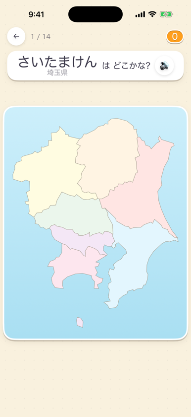
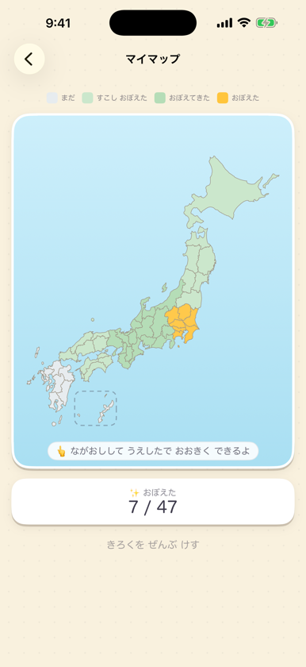
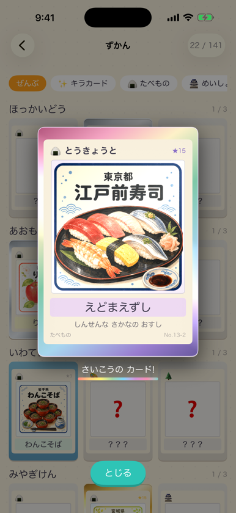

<div align="center">


# めざせ! ちずはかせ

**にほんちずを タップして、47の都道府県を あそびながら おぼえる**

5〜9さい向けの都道府県学習アプリ(iOS / iPadOS)

<a href="https://apps.apple.com/jp/app/%E3%82%81%E3%81%96%E3%81%9B-%E3%81%A1%E3%81%9A%E3%81%AF%E3%81%8B%E3%81%9B/id6800378835"></a>

</div>

<p align="center">




</p>

## あそびかた

- **ちずから さがす** — 「かながわけんは どこかな?」を聞いて地図をタップ
- **なまえを あてる** — 光った県の名前を 4 択からえらぶ(声でも答えられる)

正解するたびに、その県の**とくさんひんカード**(全 141 枚)がもらえる。
同じカードを重ねるとシルバー → ゴールド、れんぞく正解で**にじいろカード**に。
おぼえた県は**全国マイマップ**が緑 → 金色に染まっていく。

## 設計原則

子ども向けアプリとして、次を絶対条件にしている(App Store Kids カテゴリ準拠)。

- **全機能無料。** 課金・広告・外部リンクなし
- **完全オフライン。** データを収集しない・端末の外に送らない(音声認識もオンデバイス限定)
- **失わせない。** ライフ・制限時間・ストリーク喪失・習熟の減衰を作らない
- **ひらがな中心 + 読み上げ。** 文字が読めなくてもひとりで遊べる

設計判断の全記録は [CLAUDE.md](CLAUDE.md) にある。

## 技術

| 項目 | 内容 |
| --- | --- |
| プラットフォーム | iOS 17.0+ / iPadOS 17.0+ |
| 言語・UI | Swift 6, SwiftUI(@Observable / strict concurrency) |
| プロジェクト生成 | [xcodegen](https://github.com/yonaskolb/XcodeGen)(`.xcodeproj` は生成物・非管理) |
| 保存 | JSON + FileManager(自前マイグレーション、SwiftData 不使用) |
| 依存ライブラリ | なし |

## ビルド

```bash
brew install xcodegen   # 未導入なら
xcodegen generate
open ChizuHakase.xcodeproj
```

テスト:

```bash
xcodebuild test -project ChizuHakase.xcodeproj -scheme ChizuHakase \
  -destination 'platform=iOS Simulator,name=iPhone 17 Pro'
```

## データ生成

- **地図** — `tools/build_map_data.py` が GeoJSON から `PrefectureShapes.json`(47 県・約 62KB)を生成。沖縄インセットの位置も自動決定。手順は [CLAUDE.md §3](CLAUDE.md)
- **カード絵** — `tools/build_card_art.py` が手描き原画(ローカル限定)を 480px に落として asset catalog へ書き出し

App Store 用スクリーンショットは、シミュレータでデバッグルートを使って撮影できる:

```bash
xcrun simctl launch <UDID> com.wakuwaku.chizuhakase -demoSave -startAt cardBook
```

## 出典

ちずデータ: [Global Map Japan(国土地理院)](https://github.com/dataofjapan/land)をもとに簡略化
